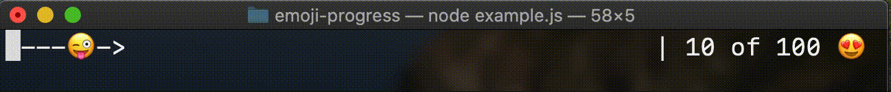

# emoji-progress

A cli progress-bar with the power of imagination 🌈 ( and emoji's 😻)

## Progress Bar

```javascript
const EmojiBar = require('emoji-progress');

const progress = new EmojiBar({
  start: 10,
  end: 100,
  unit: '😍'
});
progress.start();
setTimeout(() => {
  progress.increase(40);
  setTimeout(() => {
    progress.increase(70);
  }, 3000);
}, 3000);
```

## Loading Bar

```javascript
const EmojiBar = require('emoji-progress');

const loader = new EmojiBar({
  hideState: true,
  isLoader: true,
  autostart: true
});
setTimeout(() => {
  loader.complete();
}, 3000);
```

## Config

#### startValue

Defines the value at wich the progress bar starts.  
`startValue: 10`  
**Default:** 10

#### endValue

Defines the value at wich the progress bar end.  
`endValue: 150`  
**Default:** 100

#### isLoader

The Emojibar will now be a infiniteloader.  
`endValue: true`  
**Default:** false

#### hideState

The state (0 of 100 unit) will be hidden.  
`hideState: true`  
**Default:** false

#### autostart

The bar will start on initialisation.  
`autostart: true`  
**Default:** false

#### reverse

Sets the direction to right to left.  
`reverse: true`  
**Default:** false

#### indicator

Sets the indicator.  
`indicator: '🤩'`  
**Default:** '❤️'

#### unit

Sets the unit (10 of 100 🍌).  
`unit: 'Steps'`  
**Default:** '🍌'

#### separator

Sets the separator (| 10 of 100).  
`separator: '||'`  
**Default:** '|'

#### paddingRight

Sets the padding. This can be used if you the loader uses more than one line.  
`paddingRight: 5`  
**Default:** 0

#### paddingRight

Sets the padding. This can be used if you the loader uses more than one line.  
`paddingRight: '||'`  
**Default:** '|'

#### fillerLeft

Sets the filler at the left of the indicator.  
`fillerLeft: '#'`  
**Default:** '-'

#### fillerRight

Sets the filler at the left of the indicator.  
`fillerRight: '-'`  
**Default:** ' '

#### intervalTime

Sets the interval time. This is the refresh rate of the progress bar and the interval of the loader  
`intervalTime: '1000'`  
**Default:** 200


## Examples

### Simple 



```javascript
const progress = new EmojiBar({
  start: 10,
  end: 100,
  unit: '😍',
  paddingRight: 1,
  fillerLeft: '-',
  indicator: '😜->'
});
progress.start();
setTimeout(() => {
  progress.increase(40);
  setTimeout(() => {
    progress.increase(70);
  }, 3000);
}, 3000);
```

### Nyan Cat 


```javascript
const loader = new EmojiBar({
  hideState: true,
  indicator: '🐈',
  reverse: true,
  fillerLeft: '🌈',
  isLoader: true,
  autostart: true,
  intervalTime: 100,
});
```

### Banana 


```javascript
const progress = new EmojiBar({
  start: 10,
  end: 100,
  unit: '🍌',
  fillerRight: '🍌   ',
  fillerLeft: ' ',
  indicator: '🦍  🐅',
  isLoader: true,
  autostart: true,
  reverse: true
});
progress.start();
setTimeout(() => {
  progress.increase(40);
  setTimeout(() => {
    progress.increase(70);
  }, 10000);
}, 3000);
```